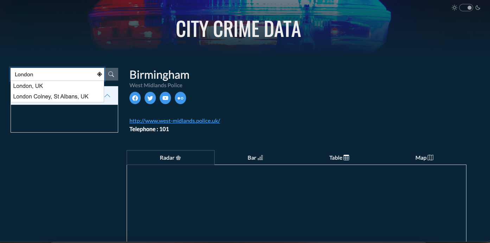
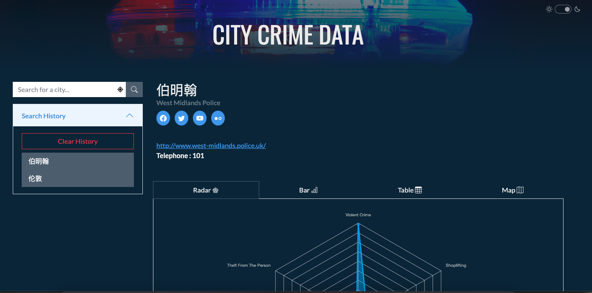
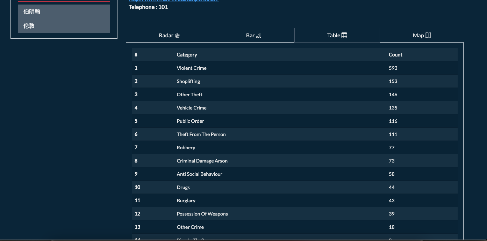
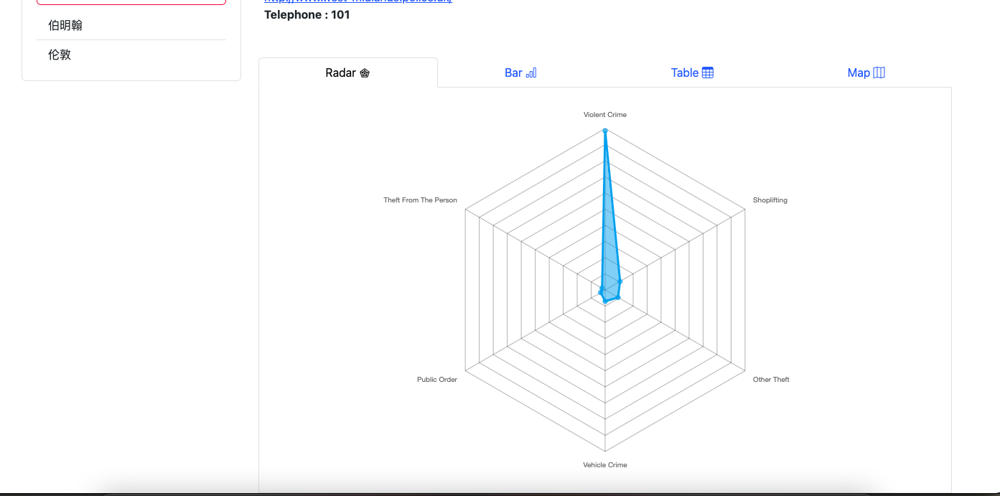

# City Crime Data

* Github URL: https://github.com/ihsanm/City-crime-data
* Deployed Site: https://ihsanm.github.io/City-crime-data/

## Description

A simple dashboard displaying local crime statistics for a searched location in England.

### Our motivation for development

* We want to be able to view recent crime information for any given location in England as we feel this would be useful for anybody thinking of perhaps taking a city break or is having to relocate for work etc. and would like to know which areas are the safest.
* We also felt that it is nice to know the levels and types of crime for the area in which you live. Could be the impetus for locking away you bike if bicycle theft is prevalent or installing an alarm system for example.

### User story

```
As a user
- I want to find the crime data of my city or other cities. 
- I want to know the various types of crime  and the data through the chart
- I also want to  find the police information of the city.
- SO THAT I can find out about the safety of the city where I live or travel and etc.
```

### Acceptance Criteria

* It will be done when the user can search for a location in Great Britain and
  * view local crime statistics in graph and table form
  * view information about the location police force (including social media links).
* The user can automatically view data for their current location
* Previous searches will be accessible for future access
* The site theme will switch to a dark theme if it is currently night time at the user location
* User will be able to override the default theme with one button click
* As the user types a search query an autocomplete list will display of matched locations.

The application will be complete when it satisfies all of the above acceptance criteria plus the following:
* Uses at least two server-side APIs 
* Links to an external site.
* Does not use alerts, confirms, or prompts - uses modals.
* Use client-side storage to store persistent data.
* Uses Bootstrap, is fully responsive and has a polished UI.

### The APIs we used and the function
 * Uses the [UK Police Data API](https://data.police.uk/docs/) to get the crime in searched area.
 * Uses [OpenWeatherMap](https://openweathermap.org/api/geocoding-api) to get the longitude and latitude.
 * Uses the [UK Police Force API](https://data.police.uk/docs/method/force/) to get a brief summary of the localities police force.
 * Uses the [Google Places API](https://developers.google.com/maps/documentation/places/web-service/autocomplete) to get an autocomplete list as the user types
  * Uses a [Reverse Geocoding API](https://api.bigdatacloud.net/data/reverse-geocode-client) to get the approximate user location by IP address
  * Uses https://api.sunrise-sunset.org to calculate the sun rise/sunset for a given location

## Table of contents
- [Installation](#installation)
- [Usage](#usage)
- [Future Development](#future-development)
- [Credits](#credits)
- [License](#license)

## Installation

N/A

## Usage

  * Find the crime data and display in graph and table form by typing the desired location in the search field and clicking the search button.
    * The search field presents an autocomplete list as you type for quick access
    * A search also retrieves information about the police force for the locality
 * Previous searches are stored in the "Search History" list
   * This element can be expanded/collapsed by clicking the section header
   * An historical search can be revisited by clicking on the relvant item in the list
   * Individual history items can be removed by clicking on the red "X" button (visible on hover)
    * The "Clear History" button removes all previous searches.
 * View the statistics in your preferred format by clicking on any of the available tabs (Radar / Bar charts or table)
 * Switch the site theme at any time by clicking the toggle button in the top right corner of the page.
 
 ### App screenshots

<table>
   <tr>
      <td></td>
      <td></td>
   </tr>
   <tr>
      <td></td>
      <td></td>
   </tr>
</table>

 ## Future Development
 * Implement a map to show where crimes had occurred
 * Improve police information shown
 * Add more themes depending on time of day
 * Broaden app scope so crime data from multiple countries can be found/visualised

## Credits
- Header background images: [Unsplash.com](https://unsplash.com/)
- Favicon: https://www.flaticon.com/

## License
Please refer to the [LICENSE (MIT)](LICENSE) in the repo.